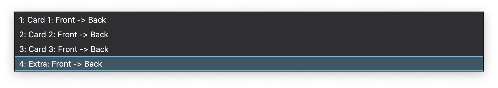



The site displays all kinds of _effects_ you can apply, when you use Closet.
This effects are things you'd want to apply to your flashcards.
These include:
- [Shuffling](../shuffling) list items
- Creating [cloze deletions](../clozes)
- Make flashcards, which [ask you to correctly sort a shuffled sequence](../shuffling/shuffle_quest)
- Create [multiple Choice questions](../multiple-choice)
- Create [image occlusions](../occlusions)

---

There are two parts to this website:
- the **effect previews**
- the **tester**

---
## Effect Previews

The effect previews contain various code displays, like the one below:



If you use [Closet for Anki](ankiweb link), there are the following things to take in account:
- the **lower part** of the display shows the text you'd fill into your **note fields**
- the **upper part** is what you expect as output on the **displayed card** in the reviewer (or previewer)
- the **buttons** signify different preconfigurations:
  - in the context of Anki this means whether it is the _front_, or the _back_ of the card.
- the **setup** button will give you the JavaScript code, you'd need to configure Closet to transform the input text in the lower part to the output text in the upper part
- clicking **tester** takes you to the other part of this website, the [tester](../tester)
  - the tester will be preconfigured with the setup of the *effect preview* you came from

---

- however Closet inherently supports the notion of different _card numbers_:
  - a lot of times you will see button labels like "Front 1", "Front 2", "Back 1", etc., or just "F1", "F2", "B1"
  - in [Closet for Anki]() itself, Closet inferes which card you're on, by looking at the card name:

In this example, "Card 1" would be considered to have card number 1, "Card 2" would have card number 2, but "Extra" would have an undefined card number.

---
## The Tester
